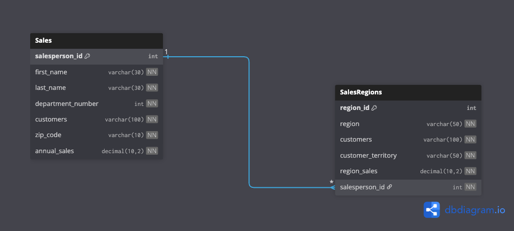

# Sales Database

### Gregory Stevenson
### University of Massachusetts Global
### CSCC-408 Database
### April 8, 2026

#### Executive Summary
In this executive summary the design and implementation of the sales database will be explained. This database's intended purpose is to track and record the sales of each sales person and by each region the organization operates in. Originally the database was to be developed using Microsoft Access Database for the relational database. This was changed to MySQL as the availability of Windows based machines by the developers and maintainers of the database is too limited to support the use of Microsoft Access. The database will be developed in such a way that the capabilities and performance using MySQL will be equivalent to Microsoft Access. 

The database will consist of two primary tables named Sales and SalesRegions. The  Sales table will store data about individual sales personnel. An Entity Relationship Diagram(ERD) can be found in the Appendix as Figure 1. Each record of a sales person will include the attributes: salesperson_id, first_name, last_name, department_number, customers, zip_code, and annual sales. The attribute of salesperson_id is the unique identifier for each record and will be used as the primary key; this will also be used as a corresponding foreign key in the SalesRegion table. This relation between the two tables is categorized as a one-to-many relationship as each sales person can be associated with only one region but each region can be associated with many sales personnel. The SalesRegion table will have the following attributes: region_id, region, customers, customer_territory, region_sales, and salesperson_id; the region_id is the primary key and is the unique identifier for each record, salesperson_id is included in this table as it is the foreign key as explained earlier. Referential integrity and data retrieval is supported and ensured by the use of the primary and foreign keys. 

There are two queries that have been predefined to support data analytics of the sales data. The first of these queries is sales_greater_25k_query; as the name suggests this will identify and return the: salesperson_id, first_name and last_name concatenated as full_name, department_number, customers, zipcode, and annual_sales in the Sales table whose annual_sales exceed $25,000 and can be executed by entering “SELECT * FROM sales_greater_25_query;”. Another stored query is sales_region_query that will return: salesperson_id, first & last lame concatenated to form full_name attribute, annual_sales, region, and region_sales; entering the statement “SELECT * FROM sales_region_query;”. If data from a specific region is needed then adding “WHERE region = “region;” can be added to return only data from that region or if multiple regions need returned “WHERE region IN (“region0”, “region1”);. 

There are two reports that are built into the database; these reports are stored as procedures. Both of the reports utilize records returned from the query sales_region_query with the attributes of: annual_sales, and region; the attribute last_name comes from the Sales table. The report labeled sales_report will return the records of each sales person with the following attributes: salesperson_last_name, sum of annual_sales as sales, customer, region. sales_territory, and zip_code; and will return these records in ascending order of sales. The final report is region_sales_report will return the records of salesperson_last_name, region as sales_territory, customer, zip_code, and an attribute of annual_sales and for each aggregation of: sum as total_sales, average as average_sales, minimum as min_sales, and maximum as max_sales for each territory. This database design is structured to provide efficient methods for supporting decision-making, tracking sales data, and identifying trends for the organization. 

Appendix

Figure 1.
Entity Relationship Diagram representing the relationships of the sales database
